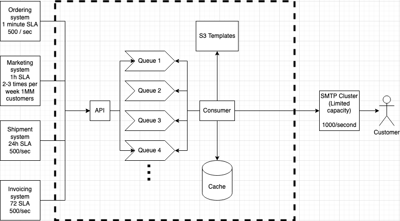

# Email Notification Service Design

## Context

We want to be able to send email notifications to customers, for example when they make orders, receive invoices, shipping updates, or marketing emails. In order to achieve this, we need to develop a new email notification service. 

## Requirements and Limitations

* Highly available
* System can handle multiple different SLAs
* The requests are not evenly distributed throughout the day. There are daily and weekly highs and lows, following usual website traffic
* SMTP Cluster has a limit of 1000 requests / second (otherwise performance degrades)

### Example

The service is used by 4 different systems with the following SLAs and traffic estimates.
1. Ordering System, 1 minute SLA, 500 requests / sec
2. Marketing System 1 hour SLA, 1,000,000 requests 2-3 times per week
3. Shipment System, 24 hours SLA, 500 requests / sec
4. Invoicing System, 72 hours SLA, 500 requests / sec

## High Level Overview



## Detailed Design

### API

The service exposes a single endpoint: 

```
POST /messages
```

with the request body confirming to the following schema

```json
{
    "type": "object",
    "properties": {
        "messages": {
            "type": "array",
            "items": {
                "type": "object",
                "properties": {
                    "sla": { "type": "number" }, // in minutes
                    "payload": { "type": "object" },
                },
            },
        },
    },
    "required": [ "messages" ],
    "additionalProperties": false
}
```
The API is going to be implemented with Fastify, which has a built-in JSON schema verification method for incoming request bodies.

The API responds with `202 Accepted` status code when the message was successfully submitted to one the queues. `500 Internal Server Error` is returned for unexpected errors, and `4xx` for incorrect API keys or invalid message bodies. The API does not return any data. 

The API is protected by API keys. The API keys are used to identify the caller. The caller's ID is then added to every message, and forwarded to the queues of the desired SLAs.

The consumers of the API are unaware of the number of available queues. The conversion from the requested SLAs to the supported ones (those that have available queues) are handled by the API: it chooses the closest available. For example, if the requested SLA is 48 hours, and the supported ones are 24 or 74 hours, it will route the request to the queue with 24 hours SLA.

As we intend to deploy the application to Kubernetes, a ConfigMap can contain the configuration for the number of available queues and their respective SLAs.

The API being stateless and only depending on the configuration files can easily be scaled up or down based on demand. Kuberentes' horizontal auto scaling can handle this for us. 

The API definition as well as the provisioned infrastructure is going to be implemented with an infrastructure as code tool. We plan to use cdk8s with TypeScript.

### Queues

To not let any messages be lost, the queues need to be highly available and scalable. To achieve this, we are going to use an active-active failover with a load balancer, and the messages kept on persistent storage. By persisting messages to shared data store, there are no risks of failing to replicate messages over network if the instance is down but the messages not yet synchronised. With an active-active failover with load balancing, the load balancer can check the healtiness of the instances and route the requests to the live instance. 

All the configuration for the queues are to be kept in version controlled config files. These configuration files are shared across the consumer, the API and the queue cluster, so all are aware of the location of the queues and the SLAs they represent.

### Queue Consumer

The queue consumer service polls the queues, populates the templated emails with the payload of the messages and submits them to the SMPT cluster with respect to the SMTP cluster's limitations.

The queue consumer service stores the email templates on an object store (we are planning to use AWS S3), based on the IDs of the service's consumers (determined by the API keys used, as described in the API section above). To store the bucket and key prefix information, we can use environment variables, stored as configuration in code.

To achieve idempotency (not delivering the same email multiple times) we are calculating the md5 hash of the emails, and store the hashes in a memory store (Redis). The steps taken for every received message is described below:
1. The message is received by the consumer
2. The ID of the service that sent the message is read from the message
3. The email template is pulled from the object store based on the ID (this can be cached if needed)
4. The email body is created using the message payload and the template
5. The md5 hash of the email is calculated
6. The queue consumer checks the hash in the Redis store. If it is already there, continue with step 9
7. If the hash wasn't found in the Redis store, send the email body to the SMTP cluster
8. Store the hash in Redis with a time-to-live set to the SLA of the queue the message was pulled from
9. Deletes the message from the queue it was pulled from

The provisioning of infrastructure and configuration are stored in version control, using cdk8s as the infrastructure-as-code tool.

Even though we are aiming for not sending a message multiple times to the customers, if for any reason this happens it is not as big a problem as not sending it at all. Although this means the Redis instance(s) do not need the same availability as the queueing system, we would still deploy Redis across multiple instances with persistent storage set up for them, so in case an instance fails, the cache is still available and the system reachable via other instances. 

We need to right-size the queue consumer so it can process the same amount of messages that the SMPT cluster can. To achieve this, we start with a small instance (to save costs) and gradually increase it in size (vertical scaling). The service needs to implement a liveliness signal, so Kuberentes can check if its operational, and if the queue consumer service fails, we boot up a new one. We need to measure how long it takes to boot a new instance, and if the cold start time is not acceptable, we might need to keep another instance warm and fail over to that when the first instance fails. This, however depends on the supported SLAs. 

The algorithm to poll the messages from the queues are the following. Working with the above example, we first poll the queue for 500 messages every second from the highest SLA levels (1 minute SLA), and then use up the remaining 500 message availability to serve the next queue. In case of a burst of messages from the Marketing Service, we allocate the remainder 500 messages to that. Within an hour, we can serve 1,800,000 messages when consuming 500/second, so this will be able to fulfill the requirements on those two, and the 24h and 72h SLAs will still be respected, as off-peak hours we have capacity to go through the remaining queues.

## Other considerations

### Security

Most of the service is deployed to a VPC's private subnet. Identity based access control is implemented, so the queues' messages and other resources (such as the templates and the Redis cache) are not accessible by anyone else but the queue consumer service. The API is deployed to the public subnet, and is protected by API keys. The API keys are stored in a secret store (such as Amazon Secret Manager).

### Availability and performance

The availability is described above in detail. The queues and the Redis cluster is running on multiple instances with persisted storage and active-active failover. The API is horizontally scalable based on the incoming requests, and the queue consumer - still dependent on measuring cold start times - can probably be implemented with a single instance with liveliness checks.

### Operations and maintenance

Each service need to define health metrics, which are logged and monitered in a dashboarding tool of choice (Grafana). Example metrics are incoming message rate, processed message rate (broken down by supported SLA types), queue lengths (broken down by SLAs), and infrastructure health metrics such as memory and CPU (especially important with the queue consumer).

### Cost

All instances need to be right-sized based on health and usage metrics. However, to achieve high availability, we need to maintain active instances for failover, which is a significant cost, but is a trade-off we need to take.

